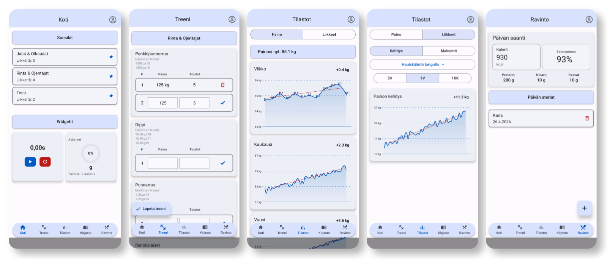
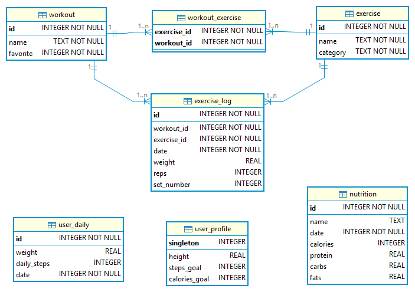

# SikaApp

> React Native mobiilisovellus kuntosalitreenien kirjaamiseen, edistyksen seurantaan ja ruokavalioon.

---



---

## Sisältö

- [Yleiskatsaus](#yleiskatsaus)
- [Ominaisuudet](#ominaisuudet)
- [Teknologiapino](#teknologiapino)
- [Arkkitehtuuri](#arkkitehtuuri)
- [Käyttäminen](#käyttäminen)
- [Tietokanta](#tietokanta)
- [Tilastot ja Matematiikka](#tilastot)

---

## Yleiskatsaus
SikaApp on React Nativella rakennettu mobiilisovellus kuntosalitreenien seurantaan. 
Käyttäjä voi seurata sarjoja, toistoja ja painoja harjoituksittain, tarkkailla kehonpainon kehitystä ajan myötä sekä visualisoida edistymistään tilastollisten kaavioiden ja trendianalyysien avulla.

Sovellus tallentaa datan paikallisesti SQLiten avulla, jolloin se toimii myös ilman verkkoyhteyttä. Käyttäjien rekisteröityminen ja kirjautuminen hoidetaan Supabase Auth -palvelun kautta. Käyttäjäkohtainen data on mahdollista varmuuskopioida sekä palauttaa pilvestä.

---

## Ominaisuudet

### Harjoitusohjelmien luonti
- Omien liikkeiden luominen ja niistä ohjelman koostaminen

### Harjoitusten kirjaaminen
- Sarjojen, toistojen ja painojen kirjaaminen liikkeittäin
- Harjoitushistoria ja henkilökohtaiset ennätykset

### Painonseuranta
- Päivittäinen painon kirjaaminen
- Trendivisualisointi valittavalta aikajaksolta

### Ruokavalio
- Aterioiden kirjaaminen
- Päivittäisen kalori -ja makromäärän seuranta

### Askelmittari
- Pävittäisen askeltavoitteen toteutumisen seuraaminen

### Synkronointi ja tunnistautuminen
- Offline-first SQLitellä - toimii ilman verkkoyhteyttä
- Varmuuskopiointi Supabaseen
- Rekisteröityminen ja kirjautuminen Supabase Authin kautta

---

## Teknologiat
 
| Kategoria | Teknologia |
|---|---|
| Sovelluskehys | React Native + Expo |
| Paikallinen tietokanta | Expo SQLite |
| Autentikaatio ja varmuuskopiointi | Supabase |
| Kaaviot | React Native Gifted Charts |
| Askeleet | Expo Pedometer |
| UI-komponentit | React Native Paper |
| Tilanhallinta | Zustand |
| Navigointi    | React Navigation + Bottom Tabs + Stack |
 
---
 
## Arkkitehtuuri
 
```
┌─────────────────────────────────────┐
│     React Native käyttöliittymä     │
│   (Paper + Bottom Tabs + Charts)    │
└────────────────┬────────────────────┘
                 │
┌────────────────▼────────────────────┐
│      Tilanhallinta (Zustand)        │
└────────────────┬────────────────────┘
                 │
┌────────────────▼────────────────────┐
│     Palvelukerros (Services)        │
│   (Validointi, bisneslogiikka)      │
└────────────────┬────────────────────┘
                 │
┌────────────────▼────────────────────┐
│          Repository Layer           │
│       (Tietokantaoperaatiot)        │  
└──────────┬──────────────┬───────────┘
           │              │
┌──────────▼──────┐  ┌────▼───────────┐
│     SQLite      │  │    Supabase    │
│  Offline-first  │  │  Varmuuskop. + │
│                 │  │  Kirjautuminen │
└─────────────────┘  └────────────────┘
```

### Kansiorakenne

```src
src
 ├── components     UI-komponentit
 ├── database       Tietokannan alustus, skeema ja repository-kerros
 ├── hooks          Custom React-hookit
 ├── screens        Näkymät
 ├── lib            Supabase client
 ├── navigation     Navigaatio (Stack + Bottom Tabs)
 ├── services       Palvelukerros (validointi, virheenkäsittely)
 ├── store          Zustand-tilanhallinta
 ├── types          TypeScript-tyypit 
 └── utils          Apufunktiot tilastoille ja matematiikalle
```

---

## Testaaminen
 
Sovelluksen EAS Preview version APK:n voi ladata osoitteesta: 
- https://expo.dev/accounts/mobiilikehitysprojekti/projects/SikaApp/builds/5be40b75-06de-4835-a264-c3edd4a5273b

Tai skannaamalla alla oleva QR-koodin:


---

## Tietokanta
### Paikallisen SQLite tietokannan rakenne


## Tilastomatematiikka
Projekti kehitetään osana matematiikan kurssia, jossa käsitellään soveltavaa tilastotiedettä. Seuraavat menetelmät on toteutettu:

| Menetelmä | Käyttökohde sovelluksessa |
|---|---|
| PNS-suora (pienimmän neliösumman) | Painon trendi, voimakehityksen seuranta |

---
